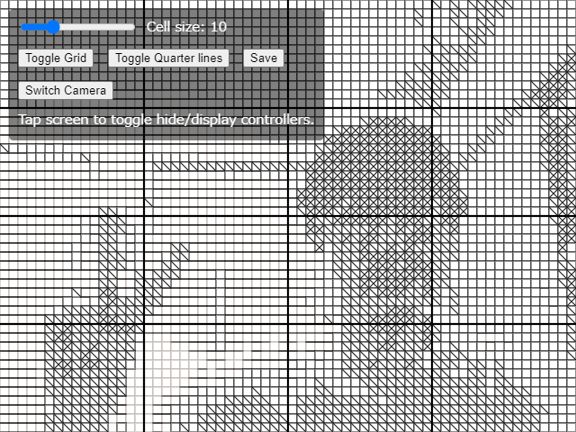
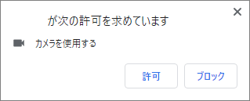
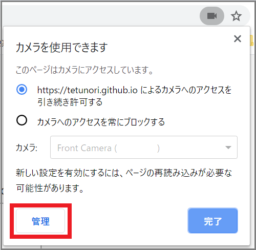
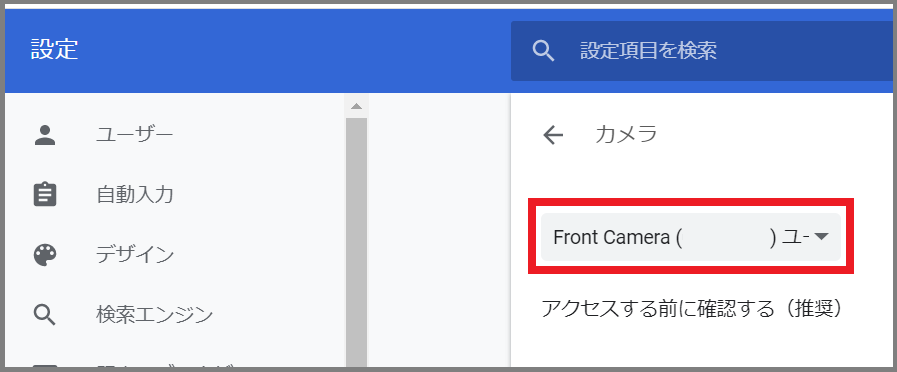

# lineSketchCamera
Version 1.0.0  

# Description
"Line Sketch" is a creative theme proposed by 吉澤春佳 on ["新しいデザインの教科書" | "new-design-textbook"](https://scrapbox.io/new-design-textbook/%E3%83%A9%E3%82%A4%E3%83%B3%E3%82%B9%E3%82%B1%E3%83%83%E3%83%81).   
This application **lineSketchCamera** enables us to convert capture image to lineSketch dynamically.

We can play on [GitHub](https://tetunori.github.io/lineSketchCamera/) and [OpenProcessing](https://www.openprocessing.org/sketch/945406).

# Usage
## Smart Device
1. Open [this tool](https://tetunori.github.io/lineSketchCamera/). Please use **Safari** on your iOS device.(Google Chrome on iOS does not work)
2. (OPTIONAL)Press "Switch Camera" button to switch another camera.
3. (OPTIONAL)Tap to toggle hide/display controllers.

## PC
1. Connect WebCam to your PC.
2. Open [this tool](https://tetunori.github.io/lineSketchCamera/). **Google Chrome** is highly recommended.
3. Give a permission. Press "Allow"/"許可" on the dialog below.
 
4. (OPTIONAL)Press "Switch Camera" button to switch another camera.
5. (OPTIONAL)Click or press SPACE key to toggle hide/display controllers.

### Supplement
If you have multiple cameras in PC, you can also switch to another camera in the following steps.
1. Press a 'Camera' icon next to the URL, then press 'Manage/管理' button.
 
2. Select a camera you would like to use in the Chrome camera setting.
 
3. (OPTIONAL) Save line sketch from buttom or 's' key. 

# Licence
This software is released under the MIT License, see LICENSE.

# Author
Tetsunori NAKAYAMA.

# References
- [lineSketch](https://github.com/tetunori/lineSketch)
- [lineSketchCamera](https://github.com/tetunori/lineSketchCamera)